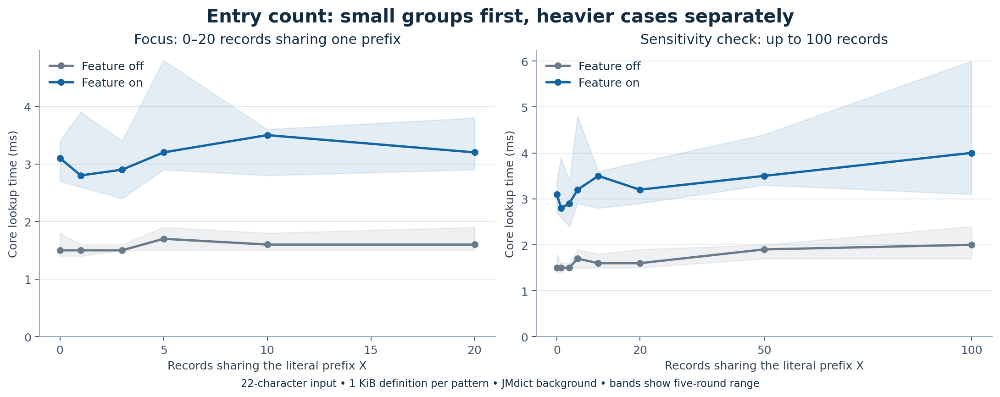
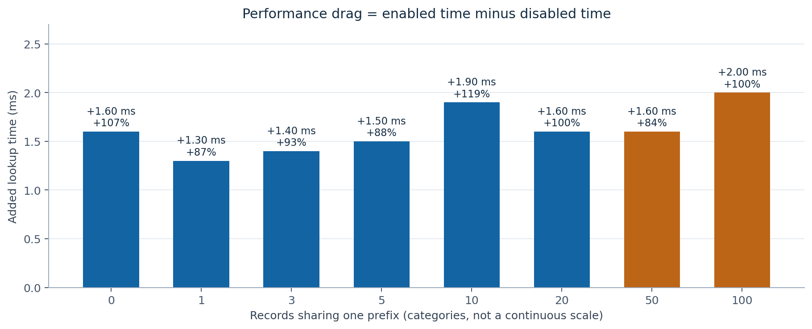
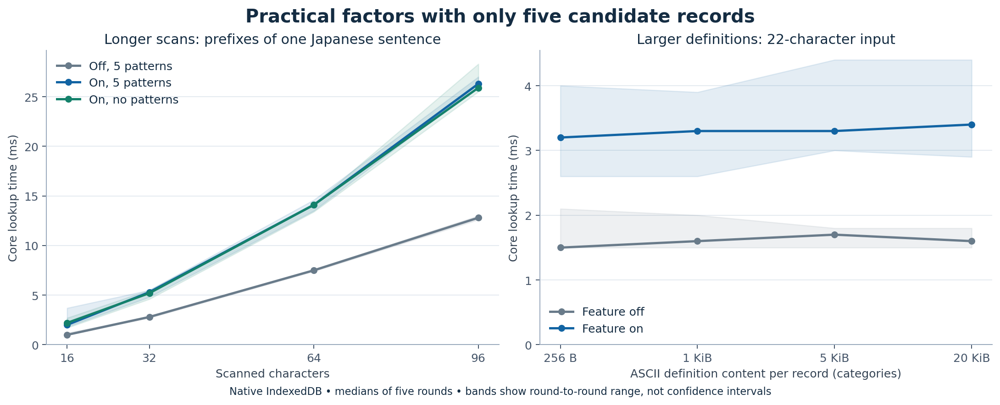

# Optional grammar wildcards: performance report

R-1. This report measures how the optional Japanese ～ matcher changes lookup time. The main experiment covers 0–20 records sharing one exact prefix, then extends to 50 and 100 as heavier sensitivity checks. These are chosen test ranges, not measured distributions of real grammar dictionaries. Hundreds or thousands of patterns under a specific prefix such as 費用が～ should not be treated as normal use.

R-2. Main finding: with five shared-prefix records, lookup measured 1.70 → 3.20 ms (+1.50 ms). At 20 records it measured 1.60 → 3.20 ms (+1.60 ms); at 100, 2.00 → 4.00 ms (+2.00 ms). The feature also has a cost when no pattern is found: 1.50 → 3.10 ms (+1.60 ms). The small-N curve is mostly flat within run-to-run variation. These results do not establish a reliable extra cost per added entry. Absolute milliseconds are more useful here than a large percentage over a short baseline.

R-3. What N means: N separate dictionary records whose expression begins with 費用が～. This is not the total dictionary size, the number of distinct prefixes, or the number of ordinary words beginning with 費用が. Each nonzero case has one matching pattern, 費用が～かかる; the remaining controlled patterns have endings that fail to match. Multiple definitions inside one glossary still count as one record. Copies stored as separate records count separately.

R-4. The fixed input is 費用が予想していた金額よりもかなり多くかかる (22 characters). Each test pattern has 1,024 ASCII definition characters. Every new experiment retains 314,984 real JMdict term records as background data. Those background records contain no supported interior ～ patterns. They exercise ordinary indexed lookup, but this setup does not represent every dictionary collection.

| Shared-prefix records N | Off (ms) | On (ms) | Added (ms) | Added time (%) |
| ----------------------- | -------- | ------- | ---------- | -------------- |
| 0                       | 1.50     | 3.10    | 1.60       | 107%           |
| 1                       | 1.50     | 2.80    | 1.30       | 87%            |
| 3                       | 1.50     | 2.90    | 1.40       | 93%            |
| 5                       | 1.70     | 3.20    | 1.50       | 88%            |
| 10                      | 1.60     | 3.50    | 1.90       | 119%           |
| 20                      | 1.60     | 3.20    | 1.60       | 100%           |
| 50                      | 1.90     | 3.50    | 1.60       | 84%            |
| 100                     | 2.00     | 4.00    | 2.00       | 100%           |

R-5. How to read the curve: even at N=0, this input causes 76 extra index requests. More records then add retrieval, string comparisons, and result work. The lower measured value at N=1 than N=0 does not mean that adding an entry makes lookup faster. Small differences between neighboring points may come from timing noise; do not infer a precise per-entry coefficient. Relative drag means (on − off) / off × 100. For example, +100% time means twice the lookup time, not the same metric as a −100% CodSpeed efficiency change.

R-6. Why the cost grows: the implementation builds candidate text forms and their prefixes, queries the expression and reading indexes, loads full rows, and then tests the pattern endings. It compares returned records with every distinct text candidate. For this input, the wildcard step builds 38 unique prefixes and examines 56 text candidates. A longer literal prefix helps only when it excludes the input. A failed ending does not avoid the row read.

R-7. Scan length deserves attention before very large prefix groups. With five nonmatching patterns, the 16-character scan measured 1.00 → 2.00 ms (+1.00 ms); the 96-character scan measured 12.80 → 26.30 ms (+13.50 ms). Enabled lookup with no wildcard records also rises from 2.20 to 25.90 ms. Longer text creates more ordinary candidates as well as more wildcard prefixes and requests. The current scan-length default is 16; reaching a distant closing literal requires a longer scan. The 96-character case represents deliberately extended scanning, not the default.

| Scan length | Off, N=5 (ms) | On, N=5 (ms) | Added (ms) | Extra index requests |
| ----------- | ------------- | ------------ | ---------- | -------------------- |
| 16          | 1.00          | 2.00         | 1.00       | 52                   |
| 32          | 2.80          | 5.30         | 2.50       | 144                  |
| 64          | 7.50          | 14.10        | 6.60       | 396                  |
| 96          | 12.80         | 26.30        | 13.50      | 652                  |

R-8. The scan-control sentence is: 費用が当初の見積もりでは十分に考慮されていなかった建物の老朽化に伴う追加工事や資材の値上がりに加えて、専門の業者に依頼するための交通費や宿泊費まで含めると、私たちが去年の会議で予想していた金額よりもはるかに多くかかる。 The test takes its first 16, 32, 64, or 96 characters. All five pattern endings deliberately fail, so this isolates scanning cost without changing the number of successful wildcard results.

R-9. Definition size is a secondary factor at small N. For five records, moving from 256 characters to 20,480 characters per definition changed enabled time from 3.20 to 3.40 ms. The latter means roughly 100 KiB of ASCII definition content across five rows. These sizes model compact versus detailed articles; they are not measured percentiles of grammar dictionaries. The timing bands overlap strongly, so this run does not establish a clear size effect at five records. The experiment measures text retrieval, not structured-layout cost or image loading. The much larger earlier payload stress test should not substitute for these small-N results.

R-10. Other plausible factors at five records: several dictionaries may repeat a pattern; a record may match both expression and reading indexes; and a dictionary may be disabled while another stays enabled. The controls below keep the same 22-character input and 1 KiB definition size. They show the size of each case locally, not a universal ranking. Their off baselines also vary slightly between runs.

| Scenario                                 | Off (ms) | On (ms) | Added (ms) | Extra rows read |
| ---------------------------------------- | -------- | ------- | ---------- | --------------- |
| No matching endings                      | 1.50     | 2.90    | 1.40       | 5               |
| One matching record                      | 1.70     | 3.20    | 1.50       | 5               |
| Five matching records / repeated pattern | 1.60     | 3.20    | 1.60       | 5               |
| Same five matches in both indexes        | 1.50     | 3.10    | 1.60       | 10              |
| Five rows in a disabled dictionary       | 1.50     | 3.00    | 1.50       | 5               |
| 100 patterns with unrelated prefixes     | 1.70     | 3.20    | 1.50       | 0               |

R-11. Interpretation: matching both indexes can read one row twice, while filtering later prevents duplicate candidate IDs. Disabled dictionaries can still incur reads because dictionary filtering happens after retrieval. Unrelated prefixes do not return those pattern rows. Dictionary count alone is therefore a weak predictor; the matching records, their sizes, and their index hits matter more. Five repeated records are a plausible way to model copies across dictionaries; thousands of copies are only an adversarial test.

R-12. Natural grammar examples use five patterns: せっかく～のに, せっかく～ても, せっかく～けれども, せっかく～だから, and せっかく～なら. The examples below vary length and wording together, so they illustrate complete inputs rather than isolate one cause. The repeated-ending sentence offers two valid のに endpoints. A long gap is not an exponential search: the matcher checks literal pieces without recursive backtracking.

| Example          | Characters | Off (ms) | On (ms) | Added (ms) | Intermediate wildcard matches |
| ---------------- | ---------- | -------- | ------- | ---------- | ----------------------------- |
| Short            | 32         | 5.50     | 8.20    | 2.70       | 1                             |
| Long clause      | 70         | 11.30    | 19.60   | 8.30       | 1                             |
| Two のに endings | 41         | 6.30     | 10.30   | 4.00       | 2                             |

R-13. Short: せっかく楽しみにしていた旅行なのに、台風で中止になってしまった。

R-14. Long clause: せっかく友達と何度も相談しながら半年も前から予定を立てて楽しみにしていた旅行なのに、出発の前日に台風が近づいてきたため中止になってしまった。

R-15. Two のに endings: せっかく遠くから来たのに店が閉まっていて、予約までしたのに誰も連絡をくれなかった。

R-16. Factors not isolated here: conjugation, kana normalization, and custom replacement rules can create more text candidates. Scanning many words in quick succession repeats the lookup cost. Popup rendering, grouping, frequency dictionaries, and rich definitions can add user-visible delay after the measured core work. Older phones, other browsers, cold database reads, or competing tabs can behave differently. No numeric multiplier is assigned to these unmeasured factors.

R-17. Practical priorities: first reduce the extra prefix construction and empty index queries, since they affect common lookups with few or no patterns. Then measure typical rich grammar articles and repeated patterns before choosing a larger cache or index redesign. Loading pattern metadata before definitions, routing candidates by prefix, and using an ID map for repeated results are possible improvements. The experiments do not prove that an internal database redesign is necessary for ordinary small-N use. The disabled feature bypasses this extra search path.

R-18. Earlier stress results are retained only as a separate scale check. Those experiments used an otherwise empty term store and different definition sizes, so their absolute timings must not be joined to the new curve. They expose limits; they do not predict typical user experience.

| Synthetic stress case                               | Off (ms) | On (ms) |
| --------------------------------------------------- | -------- | ------- |
| 1,000 same-prefix misses; 32-character definitions  | 1.30     | 6.10    |
| 10,000 same-prefix misses; 32-character definitions | 1.30     | 35.50   |
| 3,000 duplicate patterns; eight matching endings    | 2.80     | 143.40  |

R-19. Method: commit 26782fbf; Apple M5 Max; 131.0.6778.33 Chromium; native IndexedDB; Node v24.15.0. Each scenario runs in five rounds, with deterministic shuffled scenario order. Each round has eight warm-up off/on pairs and 21 timed pairs, alternating which mode runs first. The plotted value is the median of the five round medians (105 measured lookups per mode). Bands show the range of those five medians, not a confidence interval. Work counters come from a separate instrumented lookup outside the timed samples.

R-20. Scope: Japanese exact lookup, letter search resolution, deinflection enabled, simple result mode, and no frequency sorting. The benchmark directly calls the production Translator and DictionaryDatabase. It loads JMdict term rows into their internal field format, bypassing import UI, and keeps that background enabled. It uses a fresh isolated browser context and stubs only the unused media worker. Import, extension messaging, page scanning, popup rendering, and cold-start delay are excluded. These are local diagnostics, not a Playwright UI pass or CodSpeed CI result. No runtime code changed for this report.

R-21. Reproduction: evidence.zip contains measure.mjs, generate.py, raw results with every timing sample, summary.csv, and the earlier stress results. From the repository root, unzip the evidence into a temporary directory, run node /path/to/measure.mjs /path/to/jmdict_english.zip, then python3 /path/to/generate.py /path/to/output. The harness needs this checkout's Node dependencies and Playwright Chromium; the plot script needs Python with matplotlib and numpy. The JMdict fixture has revision jmdict4 and SHA-256 2583ad84ffc446122230aace230a8c5979751aaf19b28593ab7853c04a48e4f5. The dictionary itself is not bundled. HTML embeds its plots and can be shared as one file.

R-22. Artifacts: [HTML report](grammar-wildcards-performance/report.html), [CSV data](grammar-wildcards-performance/summary.csv), [reproduction bundle](grammar-wildcards-performance/evidence.zip).

R-23. Code references: [wildcard candidate lookup](../../ext/js/language/translator.js#L431), [dictionary filtering](../../ext/js/dictionary/dictionary-database.js#L288), [bulk index requests](../../ext/js/dictionary/dictionary-database.js#L620), [matcher](../../ext/js/language/grammar-wildcard.js#L25), [scan-length default](../../ext/data/schemas/options-schema.json#L776).

R-24. These timings describe commit `26782fbf`, before the later sentence-boundary check. They have not been rerun for that check; use the reproduction bundle to measure the updated code. Raw JSON is retained inside the bundle, alongside the CSV summary.
